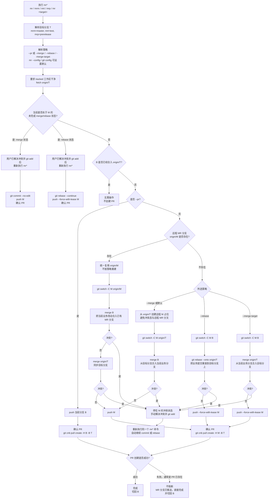

# mr

一个用于创建 CNB 合并请求的 Node CLI。它基于 Pastel + Ink + React + Zod + TypeScript，提供 `mr` 交互式选择入口，保留 `mrm`、`mrt`、`mrp` 三个短命令，并把分支判断、冲突处理、合并请求创建重试、中文 ASCII UI、dry-run、verbose 诊断和无颜色/无动画模式放到可维护的 Node 脚本里。

## 命令

```sh
mr master
mr test
mr prerelease

mr  # 交互式选择 master / test / prerelease
mrm # master
mrt # test
mrp # prerelease
mr --config # 交互式设置默认 MR 策略
```

常用 DX 开关：

```sh
mr test --dry-run       # 只看计划，不修改本地或远程状态
mr test --pr            # 直接用当前分支创建到 test 的 PR，不创建 mr/* 分支
mr test --verbose       # 输出实际执行的 git 命令和完整输出
mr test --quiet         # 只输出错误
mr test --no-color      # 禁用颜色，适合日志和无障碍场景
mr test --no-spinner    # 禁用交互式进度动画
mr -h                   # 查看帮助
mr -help                # 同样查看帮助
```

维护命令：

```sh
mr --config             # 交互式查看和设置默认 MR 策略
mr --update             # 更新到最新 GitHub Release 预构建产物
mr --uninstall          # 卸载 mr
```

## 本机启用

一键安装：

```sh
curl -fsSL https://raw.githubusercontent.com/JUNERDD/mr/main/install.sh | bash
```

安装脚本默认下载 GitHub Release 中的预构建产物 `mr.tar.gz`，不会在本机执行 `npm ci` 或 TypeScript 构建。
命令链接会优先放到当前 `PATH` 中可写的目录，安装完成后当前终端通常可以直接执行 `mr`。

卸载：

```sh
mr --uninstall
```

也可以直接执行：

```sh
curl -fsSL https://raw.githubusercontent.com/JUNERDD/mr/main/uninstall.sh | bash
```

本地开发时，也可以在当前目录执行：

```sh
nvm use
npm install
npm run fix
npm run check
npm run build
npm link
```

`npm link` 使用的是 `dist/index.js`，也就是 TypeScript 源码经构建工具转换并压缩后的版本。
`npm run fix` 是一键修复入口，会先用 Oxfmt 格式化，再用 Oxlint 应用安全 lint fix。
`npm run check` 是本地和 CI 共用的质量门禁，会依次执行 Oxfmt 格式检查、Oxlint、TypeScript strict typecheck、Vitest、tsdown build 和 `node --check dist/index.js`。

如果要用当前工作区源码打一个本地预构建包，并覆盖本机已安装的 `mr`：

```sh
npm run install:local
```

该命令会先执行 `npm run build`，再生成 `artifacts/mr.tar.gz`，最后复用 `install.sh` 从这个本地包安装。已确认不需要重新构建时，可以执行：

```sh
MR_LOCAL_SKIP_BUILD=1 npm run install:local
```

指定安装某个 release：

```sh
MR_RELEASE_TAG=v0.3.0 \
curl -fsSL https://raw.githubusercontent.com/JUNERDD/mr/main/install.sh | bash
```

## 行为

- 当前分支已经合入目标分支：直接退出，不创建 PR。
- 默认等同于 `--merge`：从目标分支准备 MR 分支，再把当前分支 merge 进去。
- 远程 MR 分支已存在：统一复用已有 MR 分支，合入当前分支并同步目标分支。
- 远程 MR 分支不存在：默认 `--merge` 会先从目标分支创建远程 MR 分支占位，再在本地从目标分支准备 MR 分支并合入当前分支。
- `--pr`：不创建 `mr/*` 分支，直接推送当前分支并用当前分支创建到目标分支的 PR。
- merge 冲突：处于 MR 分支的待解决冲突状态；解决后 `git add <files>`，再重新运行 `mr <target>` / `mrt` 提交合并结果、推送并创建 PR。
- `--rebase`：从当前分支准备 MR 分支，再 rebase 到目标分支。
- `--merge-target`：从当前分支准备 MR 分支，再把目标分支 merge 进去。
- `--pr` 和三种 MR 分支策略都适用于 `mr` 交互式选择、`mrm`、`mrt`、`mrp` 和 `mr <target>`；也可通过 `mr --config`、`git config mr.strategy pr|merge|rebase|merge-target` 或 `MR_STRATEGY=...` 设置默认策略。
- 其他中途失败：自动尝试回到初始分支。
- 默认要求 tracked 工作区干净，避免切换分支时带入未提交改动。
- 进度、诊断和错误写到 stderr，命令输出不会污染管道中的 stdout。

## 配置

默认策略遵循常见 CLI 分层：命令行 flag 只影响本次执行，环境变量适合 CI / 脚本，持久默认值写入配置。

优先级从高到低：

1. `--pr` / `--merge` / `--rebase` / `--merge-target`
2. `MR_STRATEGY=pr|merge|rebase|merge-target`
3. 当前仓库 `git config mr.strategy ...`
4. 全局用户 `git config --global mr.strategy ...`
5. 内置默认 `merge`

交互式设置：

```sh
mr --config
```

脚本友好用法：

```sh
mr --config --show
mr --config --strategy rebase
mr --config --global --strategy pr
mr --config --unset
```

## 分支逻辑图

图中 `B` 是当前业务分支，`T` 是目标分支，例如 `test`，`M` 是生成的 MR 分支 `mr/<T>/<B>`。



## UI / DX

- `mr -h`、`mr -help`、`mr --help` 都展示 Pastel 根据 Zod schema 生成的参数、选项和版本信息。
- Pastel 会给布尔 flag 展示默认值；`--dry-run` 等显示“关闭”表示该 flag 默认不启用，`--merge` / `--rebase` / `--merge-target` 显示的是“是否临时覆盖策略”，真正的默认策略由 `mr --config` 决定，内置默认是 `merge`。
- `mr` 会进入 Ink 键盘交互选择，支持上下键、数字键 `1-3`、回车确认、`q` 或 `Ctrl-C` 取消。
- `mr --config` 会进入 Ink 键盘交互设置，先选择写入当前仓库还是全局用户配置，再选择默认策略；脚本环境可用 `mr --config --strategy rebase`、`mr --config --global --strategy pr`、`mr --config --show` 或 `mr --config --unset`。
- `mr --update` 会重新执行已安装的 `install.sh`，下载最新 release 预构建产物并覆盖当前安装。
- `mr --uninstall` 会执行已安装的 `uninstall.sh`，删除命令链接、安装目录和 shell 配置片段。
- 如果旧安装目录只有 `dist/` 而缺少 `install.sh` / `uninstall.sh`，`--update` / `--uninstall` 会回退到 GitHub 上的官方脚本，并沿用当前安装目录和命令目录。
- `--version` 输出当前版本。
- `--dry-run` 展示可能执行的 git / CNB 命令，不修改本地分支、远程分支或创建合并请求。
- `--pr`、`--merge`、`--rebase`、`--merge-target` 可临时覆盖 `mr.strategy` 配置。
- 默认输出只保留关键步骤；`--verbose` 才展示完整命令和完整输出。
- 错误会给出可执行的下一步，例如缺少依赖、目标分支不存在、工作区不干净或合并冲突。
- 颜色遵循 `NO_COLOR`、`MR_NO_COLOR`、`FORCE_COLOR`、`TERM=dumb` 和 `--no-color` / `--color`。
- 非 TTY 或 CI 环境自动禁用动画，避免日志被 spinner 刷屏。

运行耗时命令时，交互式终端会显示单行 ASCII spinner；非 TTY、CI、`TERM=dumb`、无颜色输出或 `--no-spinner` 时降级为稳定文本状态：

```text
- \ | /
```

## 工程结构

源码使用 TypeScript/TSX，按职责拆分到目录，并通过测试约束每个 `src/**/*.ts(x)` 不超过 300 行。发布入口是 `src/index.ts`，构建由 tsdown/Rolldown 输出压缩后的 `dist/index.js`、`dist/commands/*.js` 和共享 chunks：

- `src/index.ts`：构建入口和兜底错误输出。
- `src/commands/`：Pastel command、Zod 参数/选项 schema 和 React/Ink 命令组件。
- `src/cli/`：Pastel 启动、生命周期命令分流、调用入口状态。
- `src/workflow/`：CNB MR 主流程编排。
- `src/git/` / `src/runtime/`：Git/CNB 命令执行、安装更新卸载、退出码和诊断。
- `src/ui/`：终端输出、颜色、动画策略和 Ink `mr` 键盘交互选择。
- `src/core/`：dry-run、目标分支、格式化、错误等可测试纯逻辑。
- `test/`：Vitest 单元测试。
- `.oxfmtrc.json`：Oxfmt 格式化配置，作为 `npm run check` 的第一道质量门禁。
- `.oxlintrc.json`：Oxlint 配置，用于快速静态检查 TypeScript、Node 和 Vitest 代码。
- `vitest.config.ts`：Vitest 配置；Git 集成测试会修改进程级 cwd/env，因此测试文件串行执行并使用更高超时。
- `tsdown.config.ts`：tsdown 构建配置，输出 bundled + minified + code-splitting 的 Pastel 可发现命令目录，并保留 `dist/index.js` 可执行权限。
- `scripts/package-release.sh`：把 `dist/`、`package.json`、`README.md`、`install.sh`、`uninstall.sh` 打包成安装脚本使用的 release 产物。

## CI/CD

GitHub Actions 会在 PR 和 `main` 推送时执行：

- `npm ci`
- `npm run check`，包括 Oxfmt、Oxlint、TypeScript strict typecheck、Vitest、tsdown build 和 dist 语法检查
- `npm run pack:release`
- 解压 `artifacts/mr.tar.gz` 并执行 `dist/index.js --version` 做冒烟验证

推送 `v*` tag 时，流水线会把以下文件发布到对应 GitHub Release：

- `mr.tar.gz`
- `mr.sha256`

发布新版本：

```sh
npm run release:patch
git push origin main --follow-tags
```

需要发 minor 或 major 时，改用 `npm run release:minor` 或 `npm run release:major`。发布脚本会先执行 `npm run check`，再由 `npm version` 自动更新 `package.json` / `package-lock.json`、创建 release commit 和 `v*` tag。CI 在 tag 构建时会校验 tag 版本必须等于 `package.json` 版本，避免发出版本号不一致的产物。

## 依赖

需要本机可用：

- Node.js 20.12+，用于运行预构建产物
- Node.js 22.18+，用于本地开发构建和 CI；仓库提供 `.node-version` 和 `.nvmrc`
- npm 10.9+，本地开发推荐使用 `packageManager` 中声明的版本
- Git
- `git cnb`

安装预构建产物只需要 Node.js、Git、curl 和 tar；npm 只用于本地开发和 CI 构建。

## 安装路径

默认安装到：

```text
~/.local/share/mr
```

命令链接默认优先放到当前 `PATH` 中可写的目录，从而安装后无需 `source` 即可直接使用。找不到合适目录时回退到：

```text
~/.local/bin
```

回退时安装脚本会把该目录写入 shell 配置，新终端自动生效。

可以通过环境变量覆盖：

```sh
MR_INSTALL_DIR="$HOME/.mr" \
MR_BIN_DIR="$HOME/bin" \
curl -fsSL https://raw.githubusercontent.com/JUNERDD/mr/main/install.sh | bash
```

## License

MIT
